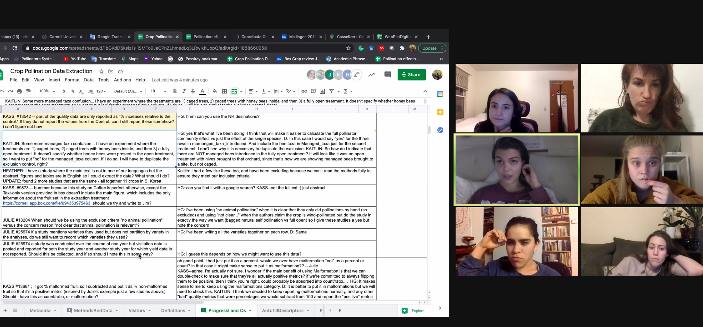
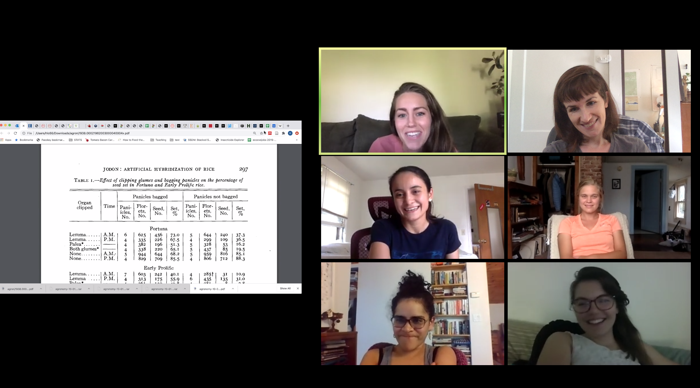

```{r setup, include=FALSE}
knitr::opts_chunk$set(echo = TRUE)
```
## Welcome!

We're so glad you're here.


#### When we're thinking hard we look like this......



#### ...but when you visit our page we look like *this*!


